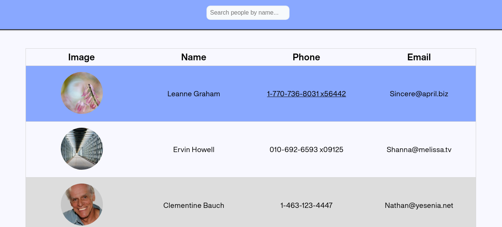

# Typescript Application


## About Application
Application use a base data from service _jsonplaceholder_ for render users, and _pixabay_ for render avatar of users. SearchBar can be use for search user by name. Also left click in user will show a profile.

## List of technologies
- TypeScript
- React
- Redux
- Jest
- Enzyme
- Webpack

## For starting use this application you should initialize a project
1. First of all, move to directory where you want to see this repo, with command in a terminal:
```zsh
cd $HOME/path/to/your-folder
```

2. Then in the terminal copy this repo with command:
```zsh
git clone https://github.com/Mirhaydarov/Typescript-React-Redux.git
```

3. And initial project:
```zsh
cd Typescript-React-Redux
npm i
```

4. For start app use command:
```zsh
npm run start
```

5. For build project in product mode:
```zsh
npm run build
```
More commands you can find in root project directory in file __package.json__ to section "scripts".
